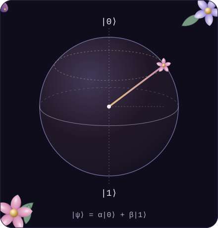

<div align="center">



<br/>

<a href="https://www.linkedin.com/in/nandika-p-t-0a923b382/"></a>


</div>



## 🌸 `$ cat about_me.py`

```python
class Nandika:
    def __init__(self):
        self.studying   = ["B.Tech CSE @ CUSAT", "BS Data Science & Applications @ IIT Madras"]
        self.role       = "SIG AI Lead @ IEEE Computer Society, CUSAT"
        self.loves      = ["machine learning", "mathematical modeling", "quantum computing"]
        self.superpower = "turning equations into things people can actually use"

    def currently(self):
        return {
            "building": "AI systems that go from idea to working product",
            "exploring": "where quantum circuits meet machine learning",
            "open_to": ["internships", "research", "collaborations"],
        }

me = Nandika()   # superposition of |math⟩ and |code⟩, blooming until measured
```


## 🌷 Things I've grown

<table>
<tr>
<td width="50%" valign="top">

### 🤖 AI Intern · Aroxiania AI
Built a **fully autonomous lead-generation system**: an AI-driven pipeline that runs end-to-end on its own.

### ⚛️ Quantum Computing Research Intern · CUSAT
Under **Dr. Sasi Gopalan** (Dept. of Mathematics), I went from Dirac notation to working circuits:
- Deutsch–Jozsa, **Grover's search** and **Shor's algorithm (N = 15)** with the QFT, in Qiskit
- A **variational quantum classifier** in PennyLane, trained on the Iris dataset
- Density matrices, entanglement, Schmidt decomposition and von Neumann entropy

</td>
<td width="50%" valign="top">

### 📐 [GraphSpace](https://github.com/Nandika32/GraphSpace) · Math Modeling Tool
A **2D and 3D graphing and visualization tool** built for an LMS platform, helping learners *see* functions and mathematical models instead of just reading them.

### 🧠 SIG AI Lead · IEEE CS CUSAT
Leading the AI special-interest group: building a community of students who learn AI by building with it.

### 🎓 Two degrees, one brain
B.Tech CSE at **CUSAT** + BS Data Science & Applications at **IIT Madras**, running in parallel.

</td>
</tr>
</table>


## 🌻 Projects in the garden

<table>
<tr>
<td width="50%" valign="top">

**🧬 [ICBI](https://github.com/Nandika32/ICBI)**<br/>
Integrated Cancer Biobank India: an AI-enabled platform unifying cancer tissue repositories across India.

**📐 [GraphSpace](https://github.com/Nandika32/GraphSpace) · [3d-graphspace](https://github.com/Nandika32/3d-graphspace) · [Math-Engine](https://github.com/Nandika32/Math-Engine)**<br/>
2D and 3D graphing and math tools for learners. `JavaScript`

**🎟️ [token-system](https://github.com/Nandika32/token-system)**<br/>
An AI-based token system. `TypeScript`

**🦙 [ollama](https://github.com/Nandika32/ollama)**<br/>
Fine-tuning an AI model. `Python`

</td>
<td width="50%" valign="top">

**🧠 [Mental-Health-Analytics](https://github.com/Nandika32/Mental-Health-Analytics)**<br/>
Streamlit-based mental health survey and analytics dashboard. `Python` `Streamlit`

**📚 [project-bibliophile](https://github.com/Nandika32/project-bibliophile)**<br/>
Data analysis of best-selling books: top authors, popular genres and market trends. `Pandas` `Matplotlib`

**🤖 [Chatterbox](https://github.com/Nandika32/Chatterbox)**<br/>
A fun Discord bot built with discord.py. `Python`

**🦇 [Batman](https://github.com/Nandika32/Batman)**<br/>
A cinematic, interactive scroll experience where armor becomes machine.

</td>
</tr>
</table>


## 🦋 The quantum garden

<table>
<tr>
<td width="45%" align="center">

</td>
<td width="55%" valign="middle">

> *Why settle for one answer when your qubits can interfere their way to the right one?*

| Algorithm | What it does | Built with |
|---|---|---|
| Qubits &amp; density matrices | States, gates, entanglement, von Neumann entropy | [Qiskit](https://github.com/Nandika32/schrodingers-cat/blob/main/qc.ipynb) |
| Deutsch–Jozsa | Constant vs balanced in **one** query | [Qiskit](https://github.com/Nandika32/schrodingers-cat/blob/main/Deutsch.ipynb) |
| Grover's search | Finds a marked state in √N steps | [Qiskit](https://github.com/Nandika32/schrodingers-cat/blob/main/grover.ipynb) |
| Shor's algorithm | Factors 15 using the Quantum Fourier Transform | [Qiskit](https://github.com/Nandika32/schrodingers-cat/blob/main/Shor.ipynb) |
| Variational Quantum Classifier | Classifies Iris flowers with 2 entangled qubits | [PennyLane](https://github.com/Nandika32/schrodingers-cat/blob/main/Untitled3.ipynb) |

🐈‍⬛ **[Open the box: schrodingers-cat](https://github.com/Nandika32/schrodingers-cat)**, where every algorithm lives as a notebook.

</td>
</tr>
</table>


## 🌼 My tech bouquet

<div align="center">

<br/><br/>

</div>


## 🌿 Stats that bloom on their own

<div align="center">

</div>

<!-- Snake eating my contributions: generated by .github/workflows/snake.yml -->
<div align="center">
<picture>
  <source media="(prefers-color-scheme: dark)" srcset="https://raw.githubusercontent.com/Nandika32/Nandika32/output/github-snake-dark.svg" />
  
</picture>
</div>


<div align="center">

### 🦋 Let's build something beautiful

Open to **internships, research and collaborations** in ML, AI, data science and mathematical modeling.

<a href="https://www.linkedin.com/in/nandika-p-t-0a923b382/"></a>

<sub>🌸 thanks for visiting my garden, you've collapsed me into |happy⟩ 🦋</sub>

</div>
